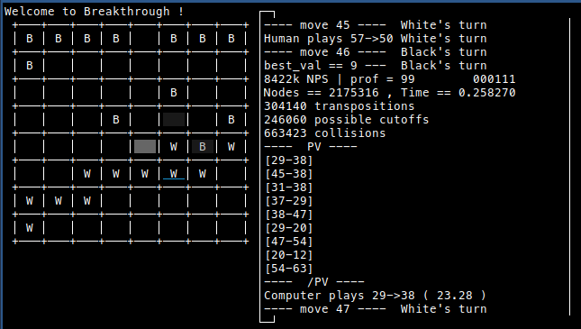

# Breakthrough

Basic AI implementation for the [breakthrough](https://en.wikipedia.org/wiki/Breakthrough_(board_game)) game with different AI availables.

This project is a tool project to explore the different algorithms with minimax-family and Monte Carlo artificial intelligences.

## Screenshot

## Available AI

### Minimax

It can use a [negamax](https://en.wikipedia.org/wiki/Negamax) AI with some optimizations, including Betamax pruning, the use of a transposition table, [Quiescence_search](https://en.wikipedia.org/wiki/Quiescence_search).

The [Principal Variation](https://www.chessprogramming.org/Principal_Variation) is shown on the logs.

### Monte Carlo

A single-CPU implementation of the [Monte Carlo](https://en.wikipedia.org/wiki/Monte_Carlo_method) algorithm is also available.

## Installing

Requirements:

- [ncurses](https://archlinux.org/packages/core/x86_64/ncurses/)

Installation:

run `make negamax` or `make mc` from the project root directory to create the executable with the desired AI.

